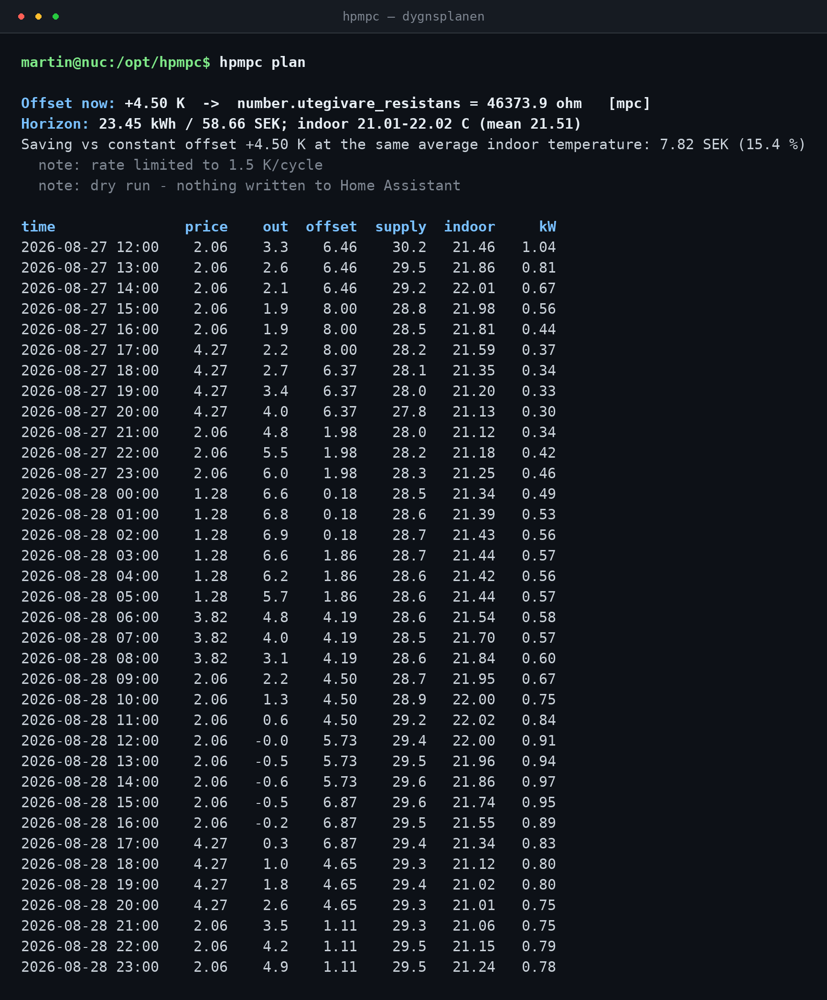
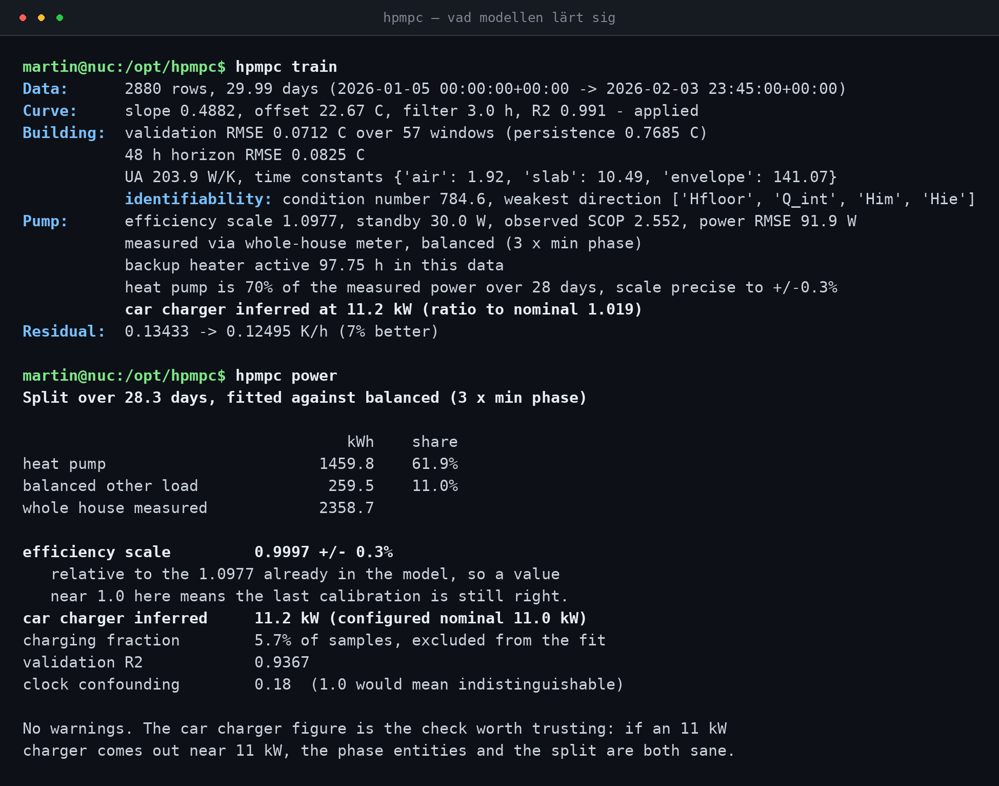
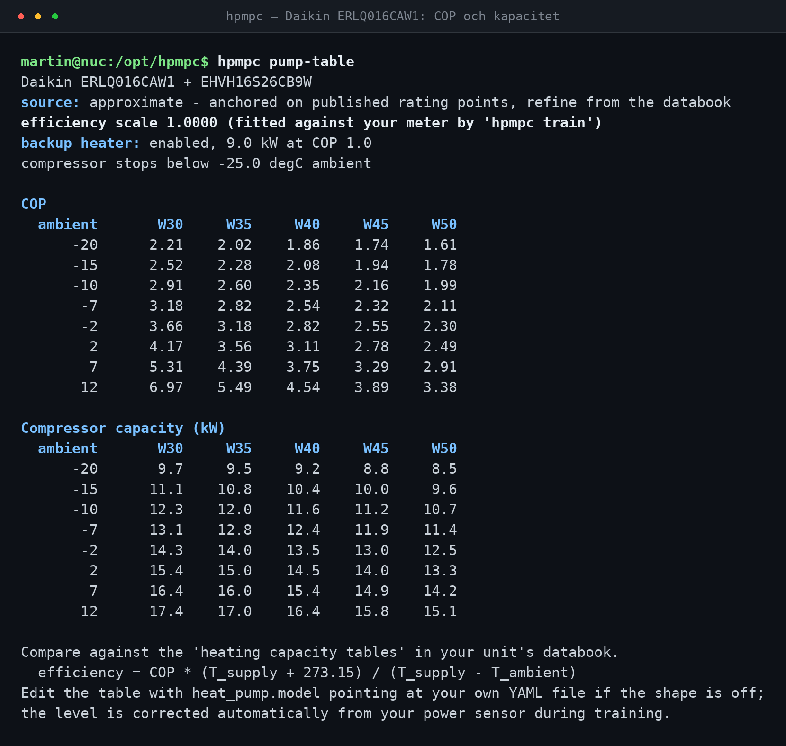
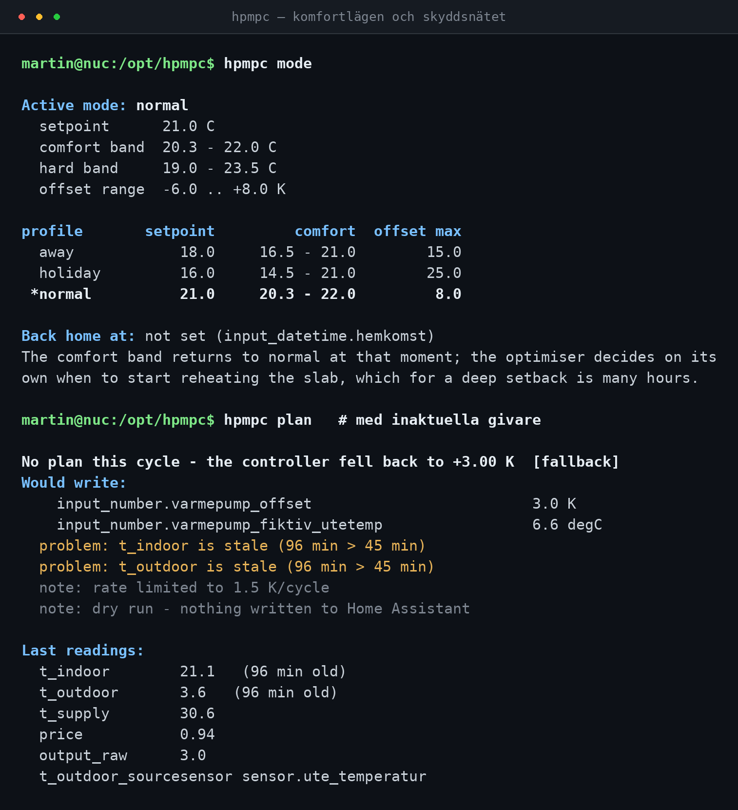
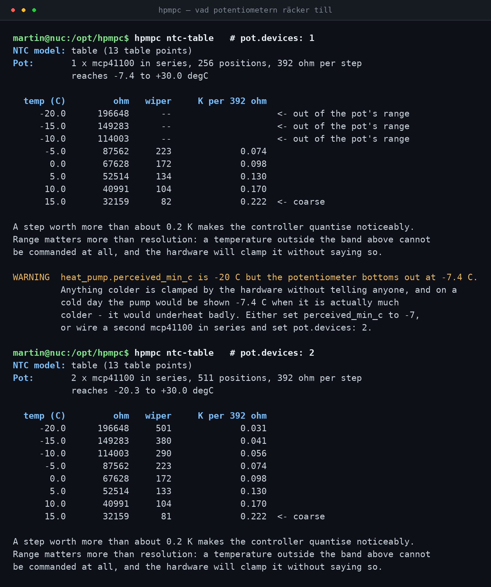

# hpmpc — självhostad ML-styrning av luft/vatten-värmepump

Modellprediktiv styrning (MPC) för en luft/vatten-värmepump på golvvärme. Systemet lär
sig ditt hus från Home Assistants historik och styr pumpen genom att manipulera vilken
utetemperatur den *tror* att den ser — via ett digitalt motstånd på en ESP32.

Allt körs lokalt: numpy, scipy och scikit-learn på en Raspberry Pi eller NUC. Ingen
molntjänst, ingen AI-tjänst, ingen API-nyckel. Utgående trafik går bara till din egen
Home Assistant, till SMHI:s öppna data och till elprisetjustnu.se.

**Tar hänsyn till:** utetemperatur, innetemperatur, vindstyrka, sol/molnighet,
luftfuktighet och elpris — plus värmepumpens COP-kurva över hela driftområdet, dess
kapacitetsgräns, elpatronen, avfrostning, husets tröghet och betongplattans värmelagring.

Levereras konfigurerad för **Daikin Altherma LT** (ERLQ016CAW1 + EHVH16S26CB9W),
**Norrköping** och **elområde SE3** — men allt det är konfiguration, inte kod.

---

## Innehåll

- [Så här ser det ut](#så-här-ser-det-ut)
- [Idén](#idén)
- [Arkitektur](#arkitektur)
- [Värmepumpsmodellen](#värmepumpsmodellen)
- [Datakällor](#datakällor)
- [Historiken är vår egen](#historiken-är-vår-egen)
- [Vad drar värmepumpen?](#vad-drar-värmepumpen)
- [Temperatur och lägen](#temperatur-och-lägen)
- [Ändra inställningar i efterhand](#ändra-inställningar-i-efterhand)
- [Snabbstart utan Home Assistant](#snabbstart-utan-home-assistant)
- [Komma igång på riktigt](#komma-igång-på-riktigt)
- [Excitation — det viktigaste steget](#excitation--det-viktigaste-steget)
- [Träning och vad siffrorna betyder](#träning-och-vad-siffrorna-betyder)
- [Backtest](#backtest)
- [Drift](#drift)
- [Säkerhet](#säkerhet)
- [Hårdvara: ESP32 och det digitala motståndet](#hårdvara-esp32-och-det-digitala-motståndet)
- [Vad kan man realistiskt spara?](#vad-kan-man-realistiskt-spara)
- [Begränsningar](#begränsningar)
- [Utveckling](#utveckling)

---

## Så här ser det ut

Systemet är ett kommandoradsverktyg plus en styrslinga som skriver till Home
Assistant. Bilderna nedan är **verklig utdata** från kommandona, körd mot det
syntetiska demohuset (`hpmpc demo`) — inte mot en riktig anläggning.

### Dygnsplanen



Offset uppåt (mindre värme) när elen är dyr 17–20, nedåt under den billiga
natten, och tillbaka upp inför morgonens pristopp. Kolumnen `price` är
marginalkostnaden med överföring, energiskatt och moms inräknade — det är den
optimeraren faktiskt planerar mot. Jämförelsen görs mot det konstanta offset som
ger samma medelinnetemperatur.

### Vad modellen lärt sig



`train` rapporterar både träffsäkerhet och *identifierbarhet* — vilka parametrar
datan faktiskt bestämmer. `power` visar hur husets totala effekt delats upp.
Den siffra som är värd mest är laddaren: den skattas helt oberoende, så att en
11 kW-laddare kommer ut på 11,2 kW säger att fasentiteterna och uppdelningen
båda är rimliga.

### Värmepumpens prestandakarta



COP och kapacitet över hela driftområdet, plus elpatronen. Det är den här
tabellen som gör att optimeraren inte kan "spara" pengar genom att omedvetet
tvinga in systemet i resistiv tillsatsvärme vid COP 1,0.

### Komfortlägen och skyddsnätet



Överst lägena; underst vad som händer när givardata blir för gammal — regulatorn
går mot `fallback_offset` i stället för att sitta kvar på ett gammalt extremvärde,
och säger rakt ut varför.

### Vad potentiometern räcker till



Överst en enda MCP41100, underst två i serie. Upplösningen är gott och väl
tillräcklig i båda fallen — 0,10 K per steg kring nollan. Det är **räckvidden** som
tar slut vid −7,4 °C med en krets: kallare än så finns ingen wiperposition att
kommendera, och hårdvaran klipper värdet utan att säga ifrån. Därför jämförs
`pot:`-sektionen mot `heat_pump.perceived_min_c` och varnar när de inte går ihop.
Se [Vad som faktiskt krävs av hårdvaran](#vad-som-faktiskt-krävs-av-hårdvaran).

---

## Idén

En värmepump med väderkompenserad framledning har ingen aning om elpriset, och den vet
inte att solen ska skina om tre timmar. Den läser bara sin utegivare och slår upp
framledningstemperaturen i sin värmekurva.

Om du kan ljuga för utegivaren kan du styra hela pumpen utan att röra dess reglering:

```
offset −3 K  →  pumpen tror att det är kallare  →  högre framledning  →  mer värme
offset +3 K  →  pumpen tror att det är varmare  →  lägre framledning  →  mindre värme
```

Golvvärme i betongplatta är ett värmelager med tidskonstant på 8–30 timmar. Det gör att
man kan **ladda plattan när elen är billig** och **glida på lagrad värme när den är dyr**,
utan att inomhustemperaturen märkbart rör sig. Det är hela affärsidén.

Två detaljer som är lätta att missa och som avgör om det fungerar:

1. **Pumpen medelvärdesbildar sin utegivare** över några timmar. Ett offsetsteg får alltså
   inte omedelbart genomslag på framledningen. Modellen har det filtret som eget tillstånd.
2. **COP styrs av den verkliga uteluften, inte den påhittade.** Framledningen följer den
   falska temperaturen, men förångaren ser den riktiga. Att ladda på natten är billigt i
   kronor men dyrare i kWh, eftersom det är kallast då. Optimeraren väger det mot varandra.

---

## Arkitektur

```
   SMHI ──väder──┐                      ┌── prestandakarta (COP, kapacitet, elpatron)
elprisetjustnu ──┤                      │
                 ▼                      ▼
Home Assistant ──historik──►  dataset ──►  systemidentifiering ──►  husmodell
      │                                                                 │
      │                              MPC-optimerare  ◄──────────────────┤
      │                                    │                            │
      │◄── ohm ──  ESP32 + digitalt ◄──────┘                        observatör
      │            motstånd  ──►  värmepumpens utegivare
```

### 1. Grey-box-modell av huset (`model/thermal.py`)

En 2R2C-modell med tre tillstånd:

| Tillstånd | Betydelse | Typisk tidskonstant |
|---|---|---|
| `Ti` | inomhusluft och lätt inredning | 1–3 h |
| `Tm` | betongplatta och tung stomme | 8–30 h |
| `Tf` | pumpens egen filtrerade utetemperatur | 1–6 h |

```
Ci·dTi/dt = Him·(Tm−Ti) + Hie_eff·(Te−Ti) + f_sol·Qs + Qint
Cm·dTm/dt = Him·(Ti−Tm) + Hme·(Te−Tm) + Qgolv + (1−f_sol)·Qs
Qgolv     = clip(Hfloor·(Tw−Tm), 0, Qmax)
Hie_eff   = Hie·(1 + k_wind·v)          ← vinden sitter här
```

Tio parametrar, alla fysikaliskt tolkbara. Det är ett medvetet val framför ett rent
neuralt nät: med 3–6 veckors data är ett neuralt nät hopplöst underbestämt och
extrapolerar farligt vid temperaturer det aldrig sett, medan en fysikalisk modell
uppför sig rimligt även utanför träningsdatan. Den *lär sig* fortfarande — men den lär
sig tio tal med betydelse i stället för tiotusen vikter.

### 2. Lärd residual (`residual.py`)

Ovanpå fysiken sitter en gradient-boosting-modell (scikit-learn) som fångar det
2R2C-modellen omöjligt kan veta: morgonduschen, braskaminen, att lågt vintersol
träffar söderfönstren hårdare än en platt globalstrålningssiffra antyder.

Den är medvetet begränsad till **exogena särdrag** — klocka, sol, vind, utetemperatur.
Aldrig husets eget tillstånd och aldrig styrsignalen. Det ger två saker: optimeraren kan
inte utnyttja den i en återkopplingsslinga, och korrektionen kan beräknas en gång per
lösning i stället för en gång per simuleringssteg. Bidraget är hårt begränsat
(`residual_max_correction`, default 0,4 K/h), och modellen kastas automatiskt om den
inte slår fysiken på valideringsdatan.

### 3. Optimeraren (`mpc.py`)

Beslutsvariabel: styckvis konstant offset över 36 timmar i 3-timmarsblock — 12 tal.

Målfunktion:

```
J = Σ pris·P·Δt                                  elkostnad
  + w_komfort · Σ avvikelse²                     mjuk komfortbandsstraff
  + w_hård    · Σ överträdelse²                  hård gräns
  + w_ändring · Σ (Δoffset)²                     lugn styrsignal
  + w_terminal·(Ti_N − börvärde)²                slutläge
  − lagrad_energi_i_plattan · pris / COP         ← avgörande
```

Den sista termen är inte kosmetika. Utan den har optimeraren en uppenbar fusk-strategi:
avsluta horisonten med kall betongplatta. Det ser billigt ut på elmätaren och ångras
tyst vid nästa omplanering, så vinsten realiseras aldrig i sluten loop. I den här koden
prissattes den lagrade värmen till vad den skulle kosta att köpa — då försvinner
incitamentet helt, och äkta förladdning när elen är billig belönas korrekt.

> Under utvecklingen påstod den öppna slingan **+13 %** besparing innan den termen
> fanns — på data där den slutna slingan levererade **−0,9 %**. Den öppna siffran var
> ren självbedrägeri. Efter fixen ligger den öppna prognosen på blygsamma ~2 % per
> lösning och den slutna slingan levererar ~5 %, alltså mer än den lovar i stället för
> mindre.

Sökningen är en cross-entropy-metod över batchade utrullningar, efterpolerad med
L-BFGS-B (ändlig-differens-gradienten beräknas som *en* batchad utrullning av 13
störda scheman, inte 13 separata anrop — det är det som gör polisheringen prisvärd på
en Pi). Sökpopulationen sås bland annat med hela rutnätet av konstanta offset, vilket
garanterar att MPC:n aldrig kan bli sämre än att bara låta offseten stå still.

En lösning tar ~0,5–1 s. Bara första blocket verkställs; resten planeras om nästa cykel.

### 4. Värmepumpen (`model/performance.py`)

En riktig prestandakarta per maskin: COP och kapacitet över hela driftområdet,
elpatronen, avfrostning och driftgränser. Se [Värmepumpsmodellen](#värmepumpsmodellen).

### 5. Regulatorn (`controller.py`)

Betongplattans temperatur mäts inte. Den skattas med en Luenberger-observatör: modellen
propageras en cykel framåt, den uppmätta innetemperaturen adopteras rakt av, och
prediktionsfelet knuffar plattans skattning. Vid kallstart görs en 24-timmars
inkörning mot verklig historik i stället för en gissning.

---

## Värmepumpsmodellen

Det här är den del som avgör om systemet sparar pengar eller bränner dem. En generisk
Carnot-modell ser inte de två sätt på vilka en väderkompenserad pump kan bli *dyrare*
av välmenande optimering:

**1. COP är inte en jämn funktion av utetemperaturen ensam.** Att höja framledningen
för att fånga en billig timme kan kosta mer verkningsgrad än priset sparar — särskilt
när det är kallt ute och lyftet redan är stort.

**2. Kompressorn tar slut.** När effektbehovet överstiger vad kompressorn klarar
täcker hydroboxens **elpatron** resten vid COP 1,0. En optimerare som inte ser det
planerar glatt en förvärmning som tyst eldar resistiv el till tre-fyra gånger priset.

Därför bär modellen en riktig prestandakarta per maskin
(`src/hpmpc/resources/pumps/daikin_erlq016caw1.yaml`):

```
hpmpc pump-table
```
```
COP
  ambient       W30     W35     W40     W45     W50
      -20      2.21    2.02    1.86    1.74    1.61
       -7      3.18    2.82    2.54    2.32    2.11
        7      5.31    4.39    3.75    3.29    2.91

Compressor capacity (kW)
  ambient       W30     W35     W40     W45     W50
      -20       9.7     9.5     9.2     8.8     8.5
        7      16.4    16.0    15.4    14.9    14.2
```

Tabellen lagras som **Carnot-verkningsgrad**, inte som COP:

```
COP = verkningsgrad(T_ute, T_fram) · (T_fram + 273,15) / (T_fram − T_ute)
```

Det är ett medvetet val. Verkningsgraden ligger i ett smalt band (0,35–0,42) över hela
driftområdet, så interpolation är stabil och extrapolation utanför tabellen förblir
fysikaliskt rimlig. Interpolerar man rå COP mellan mätpunkter får man nonsens vid små
lyft.

Ovanpå det:

- **Kapacitetsgräns per utetemperatur och framledning**, med elpatronen som täcker
  underskottet vid COP 1,0. Det gör en för aggressiv förvärmning synligt dyr i
  målfunktionen — precis den spärr du efterfrågade.
- **Kompressorstopp** under maskinens undre driftgräns (−25 °C).
- **Avfrostning** som extra avdrag när luften är fuktig kring nollan. SMHI ger relativ
  luftfuktighet, så det här är faktiskt informerat och inte gissat. Avdraget är noll
  vid referensfuktigheten, eftersom EN14511-mätpunkterna redan innehåller normala
  avfrostningsförluster.
- **Effekttak** (`control.max_electric_power_kw`). En 16 kW-kompressor plus 9 kW
  elpatron löser ut en 25 A-servis, och en förvärmningsplan är precis när de skulle
  gå samtidigt.

### Siffrornas ursprung — läs det här

Tabellen är förankrad i publicerade mätpunkter för den här maskinklassen (A7/W35
COP 4,4; A7/W45 3,3; A7/W55 2,6; A2/W35 3,6; A−7/W35 2,8; A−7/W55 1,9; A−15/W35 2,3)
och utjämnad däremellan. Det är en **välskött prior, inte tillverkarens data.**

Två saker att göra åt det:

1. Byt ut tabellen mot den riktiga från Daikins databook (avsnittet med
   kapacitetstabeller för värmedrift; verkningsgrad räknas ut med formeln ovan).
   Peka `heat_pump.model` på din egen YAML-fil.
2. **Viktigare:** låt `hpmpc train` kalibrera den mot din egen elmätare. Efter det
   sätter den levererade tabellen bara *formen*, och din mätare sätter *nivån*.
   Träningen anpassar en enda multiplikativ skala — ett väldeterminerat tal slår tio
   dåligt bestämda — och rapporterar effektfelet per utetemperaturintervall så att en
   felaktig *form* syns istället för att absorberas in i skalan:

```
Pump:      efficiency scale 0.94, standby 71 W, observed SCOP 3.14, power RMSE 132 W
           backup heater active 3.5 h in this data
           power error by outdoor bin (W): {'-10..-5C': -18.2, '-5..0C': 5.1, '0..5C': 22.4}
```

En trend över intervallen betyder att formen är fel — då är det dags för databooken.

---

## Datakällor

Systemet hämtar väder och elpris själv. Home Assistant behövs bara för husets egna
givare och för att skriva ut styrsignalen.

### Väder: SMHI öppna data

Punktprognos ur samma modell som ligger bakom den nationella prognosen. Gratis, ingen
nyckel, ingen registrering, cirka tio dygn framåt.

```
https://opendata-download-metfcst.smhi.se/api/category/pmp3g/version/2
    /geotype/point/lon/16.192400/lat/58.587700/data.json
```

Används: `t` (temperatur), `ws` (vind), `tcc_mean` (molnighet i åttondelar) och `r`
(relativ fuktighet). Fuktigheten spelar större roll än man tror — den styr hur ofta
pumpen måste avfrosta, och avfrostning är ren förlust.

Prognosen cachas i 30 minuter (SMHI uppdaterar per timme) och en gammal cache används
hellre än ingen prognos alls — men det syns i rapporten istället för att döljas.

Koordinater: kör `hpmpc geocode "Falkvägen, Norrköping"` en gång. SMHI:s rutnät är
ungefär 2,5 km, så var i Norrköping du står spelar ingen roll — och prognosen ankras
ändå mot din egen utegivare vid horisontens början.

### Elpris: SE3 via elprisetjustnu.se

Nord Pools day ahead-priser per elområde, gratis och utan nyckel:

```
https://www.elprisetjustnu.se/api/v1/prices/2026/08-26_SE3.json
```

Nord Pool avräknar i **kvartstimmar**, så ett dygn är 96 priser. Ingenting i koden
antar en viss upplösning — parsern läser `time_start` och resten räknar ut spacingen —
så timpriser fungerar lika bra. Kvartsupplösningen matchar dessutom styrsteget exakt,
så varje beslutssteg får sitt eget pris.

Morgondagens fil finns **inte** förrän Nord Pool publicerat, strax efter 13:00 svensk
tid. Det är normalt, inte ett fel: före 13 kortas horisonten av och det sista kända
priset extrapoleras. `price_extrapolated_hours` i rapporten säger hur mycket.

**Priserna är rå spot exklusive moms, överföring och energiskatt.** Det som avgör om
lastförflyttning lönar sig är marginalkostnaden:

```
marginal = (spot × price_scale + price_addition) × (1 + price_vat_pct/100)
```

Exempelkonfigurationen sätter `price_addition: 0.8855` (elöverföring plus energiskatt)
och `price_vat_pct: 25`. **Om dina 0,8855 kr/kWh redan innehåller moms**, sätt momsen
till noll i stället:

```bash
hpmpc set control.price_vat_pct 0
```

Kör `hpmpc providers` — den skriver ut din faktiska marginalkostnad så du kan stämma av
mot fakturan i ett kommando. Hoppar man över tillägget helt överdriver optimeraren den
*relativa* spridningen mellan billiga och dyra timmar och blir för ivrig; det varnar
`hpmpc providers` för.

Verifiera att båda källorna svarar från din maskin:

```
hpmpc providers
```

> **Notera:** de här två endpointsen kunde inte anropas från miljön där koden skrevs —
> utgående trafik dit var blockerad av en policy. Parsning, cachning, felhantering och
> reservvägar är testade mot mockade svar, men `hpmpc providers` är det första du bör
> köra.

---

## Historiken är vår egen

Home Assistants recorder är ett rullande fönster — tio dygn som standard — som
rensas efter ett schema som hör hemma i ett annat system. Identifieringen vill
ha sex veckor och effektuppdelningen vill ha en månad. Den vanliga lösningen är
"höj `purge_keep_days` till 45 och rör den aldrig mer", och det gör modellen
beroende av en inställning ingen kommer ihåg, i en databas som återställs från
backup, flyttas till en ny maskin eller trimmas när disken tar slut.

Så systemet sparar historiken själv istället. Varje styrcykel frågar det
recordern om **bara det som hänt sedan förra raden det lagrade** och lägger till
det i `data/history/` — en gzippad CSV per månad, cirka fyra megabyte per år.

Recordern behöver då bara hålla längre än glappet mellan två styrcykler, timmar
istället för veckor. Arkivet behåller resten i `training.archive_keep_days` dygn.

```
$ hpmpc archive
data/history
  4208 rows over 44.0 days in 2 files (0.2 MB)
  2026-07-15 17:00:00+00:00  ->  2026-08-28 17:00:00+00:00
  coverage 99.6% of the 15-minute grid
  recent gaps:
       4.5 h after 2026-08-04 15:00:00+00:00
```

Tre saker det gör med flit:

**Bara råa signaler lagras.** Solinstrålning ur molnighet och den kommenderade
offseten i kelvin räknas fram vid läsning. Rättar du NTC-tabellen eller
koordinaterna rättas därmed också den historik som läses genom dem — annars
hade gamla rader burit runt gamla fel för alltid.

**Nyaste avläsningen vinner, men en kolumn som försvinner behåller sitt förflutna.**
Den nyaste resampling-luckan är alltid halvfylld när den skrivs, så varje hämtning
tar två timmars överlapp och räknar om den. Är en givare otillgänglig i den nya
hämtningen ligger det gamla värdet kvar istället för att bli ett hål.

**De två kan aldrig hamna i konflikt.** Raderar du arkivet fyller det sig på nytt
från det recordern har kvar. Kortar du recorderns retention behåller arkivet det
det redan kopierat. Sätt `training.archive: false` så går allt direkt mot
recordern som förut — då är det retentionen som gäller igen.

Det enda recordern fortfarande styr är hur mycket historik du **ärver vid första
installationen**. Vill du kunna träna direkt istället för att vänta en månad,
höj `purge_keep_days` innan du installerar, och sänk den sedan igen.

---

## Vad drar värmepumpen?

Utan en egen mätare på pumpen finns ingen direktmätning att kalibrera verkningsgraden
mot — bara hela huset, som också innehåller en 11 kW elbilsladdare, en baslast med
egen dygnsrytm och varje apparat i byggnaden.

Det låter som ett hopplöst separationsproblem. Det är det inte, tack vare tre saker:

**1. Laddaren säger till om sig själv.** En binärsensor visar när den laddar. De
sampelen kastas helt enkelt bort ur verkningsgradsanpassningen — det finns gott om data
kvar — så laddarens exakta effekt behöver aldrig vara känd. Den skattas ändå efteråt,
enbart som kontroll: säger anpassningen 3 kW om en 11 kW-laddare är något annat också
fel.

**2. Trefaslaster sticker ut.** En 16 kW värmepump och en 11 kW laddare drar ungefär
balanserat över L1/L2/L3; nästan varje hushållslast är enfas och därmed obalanserad.
`3 × min(L1, L2, L3)` är den del av lasten som *bevisligen* är balanserad, och med
laddaren bortplockad är det mest värmepumpen. Att anpassa mot det istället för mot
totalen tar bort merparten av hushållsbruset innan regressionen ens börjar.

**3. Pumpens effekt förutsägs av fysik, inte av inlärning.** Den termiska modellen vet
redan hur mycket värme som levereras och prestandakartan vid vilken COP. Bara *nivån*
är okänd — en enda skalär. Det är inte "hitta värmepumpen i datan" utan "skala en känd
form", vilket är en långt bättre ställd fråga.

Kvar blir en linjär regression:

```
P_mätt = c · (Q_kompressor / COP_karta) + Q_elpatron + baslast(timme, helg)
```

löst för `c = 1/efficiency_scale` och en jämn baslastprofil, med robust Huber-vikt så
att en bastu på 6 kW inte läses som värmepump.

Baslastmodellen får **medvetet** bara klockan och veckodagen som variabler. Ingen
utetemperatur, ingen vind, ingen sol. Vilken som helst av dem korrelerar med det som
driver värmepumpen, och skulle låta baslasttermen suga upp pumpens signal — det enda
fel som tyst skulle korrumpera hela verkningsgradsuppskattningen.

### Vad det ger

Verifierat mot ett syntetiskt hus där sanningen är känd — 30 dygn, elbilsladdning på
slumpade kvällar, sex apparathändelser per dygn, ojämn fasfördelning:

| verklig skala | funnen | fel | laddare funnen |
|---|---|---|---|
| 1,00 | 1,015 | +1,5 % | 11,2 kW |
| 0,85 | 0,861 | +1,3 % | 11,2 kW |
| 1,25 | 1,274 | +1,9 % | 11,2 kW |

Med bastuspikar på 3–6,5 kW två gånger om dygnet: +1,5 %. Med bara 7 dygn data:
+7,5 % — och då varnar rapporten för att datan är för kort.

```bash
hpmpc power
```
```
Split over 28.3 days, fitted against balanced (3 x min phase)

                                   kWh    share
heat pump                       1234.1    57.8%
balanced other load              252.2    11.8%
whole house measured            2135.3

efficiency scale         0.9997 +/- 0.3%
car charger inferred     11.2 kW (configured nominal 11.0 kW)
charging fraction        5.7% of samples, excluded from the fit
clock confounding        0.26  (1.0 would mean indistinguishable)
```

Den siffra som är värd mest är **laddaren**: den skattas helt oberoende, och om en
11 kW-laddare kommer ut nära 11 kW är fasentiteterna och uppdelningen båda rimliga.

`± 0,3 %` är *precision*, inte *träffsäkerhet* — den mäter slumpfelet, inte systematiskt
fel från modellavvikelser. Därför varnar rapporten separat om mindre än 14 dygn använts,
även när precisionen ser bra ut.

`clock confounding` är den ärliga svagheten: utetemperaturen har en dygnsrytm och det har
baslasten också, så de kan handlas mot varandra. Det är ett andra skäl att köra
`hpmpc excite` — att flytta offseten enligt ett schema som inte har med klockan att göra
är precis vad som bryter den kopplingen.

---

## Temperatur och lägen

Börvärdet är **det enda talet**. Allt annat om komfort uttrycks relativt det:

```yaml
control:
  setpoint: 21.0
  comfort_below: 0.7      # optimeraren rör sig fritt mellan 20,3 ...
  comfort_above: 1.0      # ... och 22,0
  hard_below: 2.0         # och straffas hårt utanför 19,0 ...
  hard_above: 2.5         # ... till 23,5
```

Det är inte bara prydlighet. Med absoluta gränser går det att sätta ett
semesterbörvärde på 16 och lämna kvar ett komfortband som fortfarande kräver
20,3 — huset kyls aldrig ner och inställningen ser ut att inte göra någonting.
Relativa gränser gör det omöjligt att uttrycka.

Ändra börvärdet från en HA-instrumentpanel (`input_number.inne_borvarde`) eller
från kommandoraden:

```bash
hpmpc set control.setpoint 21.5
```

### Lägen

Ett läge är ett namngivet börvärde. Semesterläget är alltså ett tal.

```yaml
modes:
  default: normal
  holiday_entity: input_boolean.semesterlage    # brytaren du slår av på väg ut
  entity: input_select.varmepump_lage           # eller en väljare med alla lägen
  profiles:
    normal:  {setpoint: 21.0}
    away:    {setpoint: 18.0, comfort_below: 1.5, comfort_above: 3.0, ...}
    holiday: {setpoint: 16.0, comfort_below: 1.5, comfort_above: 5.0, ...}
```

```bash
hpmpc mode holiday      # eller slå brytaren i Home Assistant
hpmpc mode              # visa aktivt läge och alla profiler
```

Semesterbrytaren vinner över väljaren — det är den man når i en hast, och de
två ska inte kunna säga emot varandra. Ett aktivt läge vinner också över
börvärdeshjälparen, så en glömd panelinställning kan inte tyst avbryta
semesterläget.

Två detaljer i profilerna som är lätta att få fel och som kostar dyrt:

**Nedsänkningsband är medvetet osymmetriska.** När ingen är hemma är *för kallt*
det enda som spelar roll; att det är varmare än nedsänkningsmålet kostar pengar
och pristermen avskräcker redan. En snäv övre gräns skulle dessutom *förbjuda*
återuppvärmning av plattan inför en hemkomst — vilket är hela poängen med att
ange en hemkomsttid.

**En djup nedsänkning kräver mycket mer offsetauktoritet än daglig finjustering.**
Värmekurvan är byggd för att hålla 21 °C. För att glida ner till 16 °C vid
−6 °C ute måste pumpen visas ungefär **+14 °C** — alltså tjugo kelvins offset,
inte fyra:

```
för att hålla 16 °C vid −6 °C ute:  platta 19,8 °C, framledning 25,3 °C
kurvan ger den framledningen vid en upplevd utetemperatur på +14,3 °C
→ krävd offset: +20,3 K, mot konfigurerade offset_max på +4 K
```

Därför får semesterprofilen sin egen `offset_max: 25`. Den absoluta gränsen för
vad pumpen någonsin får se (`heat_pump.perceived_max_c`) gäller fortfarande, och
det är den inställningen som håller det säkert. Skulle gränsen ändå ta slut
säger kontrollern det rakt ut i sina `notes` istället för att tyst sitta fast.

### Hemkomst

En betongplatta har tio timmars tidskonstant. Ett hus som stått på 16 grader
värms inte upp när du kommer hem — det värms upp dagen därpå.

Tala om när du är tillbaka (`input_datetime.hemkomst`), så återgår komfortbandet
till det normala i det ögonblicket. Optimeraren, som planerar 36 timmar framåt,
ser gränsen komma och räknar själv ut när uppvärmningen ska börja och vilka
timmar värmen ska köpas i. Ingen förvärmningsheuristik, ingen fast framförhållning:

```
hemkomst om 20 h → återuppvärmningen startar direkt (den behöver hela sträckan)
                   innetemperatur vid hemkomst: 20,2 °C mot komfortgolv 20,3 °C

hemkomst om 30 h → återuppvärmningen startar först vid t+16 h
                   den har mer slack, glider längre och köper värmen billigare
```

Samma sak fungerar för `away` under arbetsdagen, om du har en pålitlig
hemkomsttid.

---

## Ändra inställningar i efterhand

Två vägar, för två olika situationer.

### Från en Home Assistant-instrumentpanel

Mappa ett fält till en hjälpentitet, så läser regulatorn den vid nästa cykel — ingen
omstart, ingen filredigering:

```yaml
runtime_overrides:
  control.price_addition: input_number.eloverforing_kr_per_kwh
  control.setpoint: input_number.inne_borvarde
  control.comfort_min: input_number.komfort_min
  control.comfort_max: input_number.komfort_max
  control.max_electric_power_kw: input_number.effekttak_kw
  control.dry_run: input_boolean.hpmpc_dry_run
```

`ha/packages/heatpump_mpc.yaml` innehåller hjälparna färdiga.

Varje fält har ett tillåtet intervall. En hjälpentitet som råkar rapportera något
orimligt kan alltså inte prata regulatorn in i ett 40-gradigt börvärde — värdet
ignoreras med en notis. Och en ändring som skulle göra konfigurationen inkonsekvent i
sig (komfortbandet utanför de hårda gränserna) rullas tillbaka **i sin helhet**, aldrig
halvvägs.

Strukturella inställningar — horisontlängd, blockstorlek, optimerarens form — går
medvetet inte att ändra så här: de definierar lösaren som redan är byggd.

### Från kommandoraden

```bash
hpmpc settings                                  # vad som går att ändra, och till vad
hpmpc set control.price_addition 0.8855         # ändrar config.yaml
```

`hpmpc set` redigerar bara den enda raden och behåller alla kommentarer — filen är
mestadels kommentarer som förklarar *varför* varje tal är som det är, och de är värda
mer än bekvämligheten i att serialisera om dokumentet. Den vägrar också skriva en fil
som inte skulle gå att läsa in.

En regulator som redan kör läser om `config.yaml` när filen ändras, så du behöver inte
starta om den heller.

---

## Snabbstart utan Home Assistant

Hela kedjan körs mot ett syntetiskt hus med känd sanning — bra för att se att det
fungerar innan du kopplar in något:

```bash
python -m venv .venv && source .venv/bin/activate
pip install -e ".[dev]"

hpmpc demo --days 25 --backtest-days 3
```

Den genererar 25 dygn syntetisk historik (med Daikin-prestandakartan i loopen),
identifierar huset, jämför de återfunna parametrarna mot sanningen och kör ett backtest.
Ungefär vad du ska se:

```
Curve:     slope 0.3518, offset 22.956 C, filter 3.0 h, R2 0.9933 - applied
Building:  validation RMSE 0.085 C over 47 windows (persistence 1.008 C)
           48 h horizon RMSE 0.066 C
           UA 201.8 W/K, time constants {'air': 1.96, 'slab': 10.6, 'envelope': 142.7}
Pump:      efficiency scale 1.072, standby 66 W, observed SCOP 3.147, power RMSE 129 W
           power error by outdoor bin (W): {'-30..-15C': -44, '-5..0C': 11, '10..30C': 38}

     parameter         true      fitted     error
     Ci              2100.0      2187.3       +4%
     Cm             26000.0     26617.2       +2%
     Him              980.0       947.2       -3%
     Hie              165.0       168.1       +2%
     k_wind            0.045       0.046      +3%
     Q_int            420.0       441.1       +5%
     Hfloor          1350.0      1531.2      +13%
     A_sol              5.5         4.8      -13%   <- flaggad som svagast identifierad
     UA (W/K)         195.0       201.8       +3%
```

Två saker att notera. `A_sol` är den parameter som avviker mest, och
identifierbarhetsrapporten pekar ut solaperturen som den svagast bestämda riktningen —
diagnostiken säger alltså sanningen om sig själv. Och `k_wind`, vindens påverkan på
värmeförlusten, återfinns inom 3 % trots att den bara syns indirekt i innetemperaturen.

---

## Komma igång på riktigt

### 1. Förutsättningar

Home Assistant. Recordern får gärna spara några veckor för de aktuella entiteterna,
men det är inget krav: hpmpc kopierar historiken till sitt eget arkiv varje
styrcykel, så recordern behöver bara hålla längre än glappet mellan två cykler.
Se [Historiken är vår egen](#historiken-är-vår-egen).

Nödvändigt: **innetemperatur**. Det är den enda entiteten som måste finnas.

Utetemperaturen hämtas från SMHI när `entities.outdoor_temp` är tom, vilket den är
som standard — ingen utegivare behövs. Har du en givare vid huset är den bättre, för
den mäter luften byggnaden faktiskt förlorar värme till istället för en 2,5 km stor
rutas medelvärde. Skriv i så fall in dess entitets-id, så vinner den automatiskt.
Detsamma gäller vind och molnighet: SMHI när inget är konfigurerat.

Starkt rekommenderat: **framledningstemperatur** (gör modellanpassningen dramatiskt
bättre) och **någon effektmätning** — antingen en mätare på pumpen, eller husets totala
effekt per fas plus laddarens laddstatus, se [Vad drar värmepumpen?](#vad-drar-värmepumpen).

Nyttigt: luftfuktighet (driver avfrostningsmodellen) och en avläsning av vad ESP32:n
driver potentiometern till (`entities.pot_wiper`).

### 2. Installera

```bash
git clone <detta repo> && cd machine-learning
python -m venv .venv && source .venv/bin/activate
pip install -e .

hpmpc init-config --config config/config.yaml
export HA_TOKEN="<long-lived access token från din HA-profil>"
```

Exempelkonfigurationen är redan ifylld för Daikin Altherma LT, Norrköping och SE3.
Byt ut entitets-id:n mot dina egna.

### 3. Kontrollera att allt svarar

```bash
hpmpc check          # entiteter i Home Assistant: värde, ålder, det som saknas
hpmpc providers      # SMHI och SE3-priser, plus din faktiska marginalkostnad
hpmpc pump-table     # COP- och kapacitetstabellerna — jämför mot databooken
hpmpc settings       # vad du kan ändra i efterhand utan att röra koden
```

Stäm av `hpmpc providers`-utskriften mot din elfaktura. Den skriver ut
marginalkostnaden med ditt tillägg och din moms inräknade, och det är den siffran
optimeraren faktiskt planerar mot.

### 4. Ställ in värmekurvan och givaren

Daikin anger kurvan som två punkter. Räkna om dem istället för att göra det för hand —
det här är det enda talet som styr allt annat:

```bash
hpmpc curve --point=-15:40 --point=15:25
```

Mät din egen utegivare vid två eller tre kända temperaturer (isvatten är en gratis och
exakt nollpunkt) och anpassa NTC-modellen:

```bash
hpmpc calibrate-ntc --point=0:66800 --point=25:20000
hpmpc ntc-table --step-ohm 195     # kollar upplösningen din hårdvara ger
```

### 5. Samla data

```bash
hpmpc collect --days 45
```

Läs varningen i slutet. Om `offset_excitation.std` är nära noll saknar datan den
variation som behövs — se nästa avsnitt.

`hpmpc archive` visar hur mycket historik systemet har sparat åt sig själv, och
var hålen sitter.

### 6. Excitera, träna, kör

```bash
hpmpc excite            # ~1 vecka under eldningssäsong
hpmpc collect --days 45
hpmpc train
hpmpc power             # kontrollera effektuppdelningen — laddaren ska hamna nära 11 kW
hpmpc plan              # visa planen utan att skriva något
hpmpc run               # skarp drift
```

Alla kommandon:

| Kommando | Gör |
|---|---|
| `init-config` | skriv en startkonfiguration |
| `check` | verifiera Home Assistant och entiteterna |
| `providers` | verifiera SMHI och SE3-priserna, visa din marginalkostnad |
| `power` | visa hur husets effekt delas mellan pumpen och resten |
| `mode` | visa eller byta komfortläge (normal / away / holiday) |
| `settings` | vad som går att ändra i drift, och till vad |
| `set` | ändra en inställning i config.yaml |
| `geocode` | slå upp koordinater för en adress |
| `curve` | räkna om Daikins tvåpunktskurva till lutning/offset |
| `pump-table` | visa COP- och kapacitetstabellerna |
| `calibrate-ntc` | anpassa NTC-modellen till dina mätningar |
| `ntc-table` | visa NTC-kurvan och upplösningen per resistanssteg |
| `archive` | vår egen kopia av historiken — omfång, hål, storlek |
| `collect` | uppdatera arkivet och bygga ett dataset av det |
| `excite` | kör identifieringsexperimentet |
| `train` | anpassa modellen |
| `plan` | lös en gång och skriv ingenting |
| `backtest` | spela upp historiken, MPC mot konstant offset |
| `run` | styrslingan |
| `serve` | styrslingan plus lokalt HTTP-API |
| `demo` | hela kedjan mot ett syntetiskt hus |

---

## Excitation — det viktigaste steget

Det här är det steg som brukar hoppas över och som avgör om modellen blir något värd.

Om offseten aldrig rör sig i historiken kan anpassningen inte veta **hur mycket** huset
reagerar på en offsetändring. Den ser bara utetemperatur och innetemperatur samvariera
och kan inte separera "huset svarar starkt på offset" från "det blev varmare ute".
Modellen blir då utmärkt på att beskriva det förflutna och oduglig på att styra.

```bash
hpmpc excite --hold-hours 6
```

Håller ett pseudoslumpmässigt offset i sextimmarsblock. Komfortvakten är aktiv hela
tiden — huset lämnar aldrig det hårda bandet. En vecka under eldningssäsong räcker
gott. Kör det gärna igen efter en säsong.

`hpmpc collect` varnar automatiskt när excitationen är för svag.

---

## Träning och vad siffrorna betyder

```
Building:  validation RMSE 0.146 C over 47 windows (persistence 1.176 C)
           48 h horizon RMSE 0.121 C
           UA 221.7 W/K, time constants {'air': 1.95, 'slab': 8.38, 'envelope': 91.57}
           identifiability: condition number 236, weakest direction ['f_sol_i', 'A_sol']
```

- **validation RMSE** — fel i flerstegsprediktion av innetemperaturen över 12 h på data
  som inte använts i anpassningen. Under 0,3 °C är bra, under 0,5 °C användbart.
- **persistence** — samma mått för "gissa att temperaturen står still". Modellen måste
  slå den med god marginal, annars har den inte lärt sig något.
- **48 h horizon RMSE** — samma sak över två dygn. Det är den siffran som säger om
  betongplattans dynamik är rätt, och alltså om lastförflyttningen kommer att fungera.
- **UA** — husets värmeförlustkoefficient i W/K. Jämför med din egen känsla: ett hus som
  drar 5 kW vid −5 ute och 21 inne har UA ≈ 190 W/K.
- **identifiability** — hur väl datan faktiskt bestämmer *varje enskild* parameter.
  Ett högt konditionstal betyder att flera parametrar handlas mot varandra: prediktionen
  kan vara utmärkt medan de individuella talen är närmast godtyckliga. `weakest_direction`
  pekar ut vilka. Citera inte ett U-värde ur den här anpassningen utan att titta här först.

Anpassningen använder två fönsteruppsättningar samtidigt — korta (12 h) som binder den
snabba luftdynamiken och långa (48 h) som binder plattan. Bara korta fönster lämnar
värmelagringskapaciteten — själva grunden för hela idén — praktiskt taget obestämd.

Varje fönster föregås av en inkörningsperiod som simuleras men inte poängsätts, så
plattans okända starttemperatur hinner glömmas bort innan felet räknas.

---

## Backtest

```bash
hpmpc backtest --days 7
```

Spelar upp historiken: vid varje styrcykel planerar MPC:n om mot det väder och de priser
som faktiskt inträffade, verkställer sitt första block, och modellen stegas framåt.

```
                               MPC    constant
electricity (kWh)            224.1       225.2
cost (SEK)                  184.19      192.22
stored heat (SEK)             1.59       -0.51
net cost (SEK)              182.60      192.73
mean indoor (C)              21.04       21.01
min indoor (C)               20.12       19.46
Kh outside comfort            0.80       11.04

Saving: 10.13 SEK (5.3 %) at equal average indoor temperature
        of which 8.03 SEK on the meter and 2.11 SEK in heat left in the slab
Energy: -0.5 % kWh
```

Två saker att lägga märke till. Det mesta av besparingen syns faktiskt på elmätaren
(8,03 av 10,13 kr) — resten är värme som ligger kvar i plattan och krediteras till vad
den skulle kosta att köpa. Och komforten blir samtidigt **mycket** bättre: 0,8 mot 11,0
kelvintimmar utanför komfortbandet, eftersom ett konstant offset inte kan förutse ett
väderomslag.

Jämförelsen görs mot det **konstanta offset som ger samma medelinnetemperatur**, och
kostnaden räknas netto efter den värme varje körning lämnar kvar i plattan. Att jämföra
brutto mot offset 0 vore ohederligt på två sätt: en del av besparingen skulle bara vara
ett kallare hus, och den som slutar perioden med kall platta skulle belönas för det.

Kör minst sju dygn. På kortare perioder kan terminaltermen bli en stor andel av
besparingen och siffran blir skör.

Läs förbehållen som skrivs ut: i uppspelningen *är* modellen verkligheten, och prognoserna
är perfekta. Siffran är alltså en övre gräns. Modellens egen träffsäkerhet är den andra
halvan av sanningen och rapporteras av `hpmpc train`.

---

## Drift

### Docker på en egen maskin

**[INSTALL.md](INSTALL.md) har hela genomgången** för en NUC med Docker och
Portainer, inklusive recorder-inställningar, verifiering innan skarp drift och
säkerhetskopiering. Kortversionen:

```bash
git clone <repo> /opt/hpmpc && cd /opt/hpmpc
mkdir -p config && echo "HA_TOKEN=<token>" > .env
docker compose build
docker compose run --rm hpmpc init-config      # skriver config/config.yaml
docker compose up -d
docker compose exec hpmpc hpmpc check
```

Imagen sätter `HPMPC_CONFIG` och datasökvägarna till de monterade volymerna, och
exempelkonfigurationen läser dem — samma fil fungerar alltså både i containern
och från en utcheckning, utan redigering.

Omträningen sköter sig själv: `training.retrain_days: 30` gör att tjänsten
tränar om när modellen blivit en månad gammal, vid en lugn timme. Ingen cron
behövs.

### systemd

```ini
[Unit]
Description=Heat pump MPC
After=network-online.target

[Service]
Type=simple
User=hpmpc
WorkingDirectory=/opt/hpmpc
Environment=HA_TOKEN=...
ExecStart=/opt/hpmpc/.venv/bin/hpmpc --config /opt/hpmpc/config/config.yaml serve
Restart=always
RestartSec=30

[Install]
WantedBy=multi-user.target
```

Träna om en gång i månaden under säsong — eller låt `training.retrain_days`
göra det åt dig:

```
0 4 1 * *  cd /opt/hpmpc && .venv/bin/hpmpc collect && .venv/bin/hpmpc train
```

### HTTP-API

| Endpoint | Beskrivning |
|---|---|
| `GET /health` | öppen; status, drifttid, senaste fel |
| `GET /status` | senaste cykelns rapport |
| `GET /plan` | löser en gång och returnerar planen utan att skriva |
| `POST /step` | kör en styrcykel nu |
| `GET /model` | parametrar, tidskonstanter, träningsmetadata |
| `GET /metrics` | Prometheus-format |

Sätt `HPMPC_API_KEY` för att kräva `X-API-Key` på allt utom `/health`.

### Home Assistant-paket

`ha/packages/heatpump_mpc.yaml` innehåller offset-hjälparen, dashboard-sensorer och —
viktigast — en **dödmansgrepp-automation**.

---

## Säkerhet

Ett fastnat extremt offset är den enda felmoden som verkligen kostar pengar eller komfort.
Sex oberoende lager:

1. **Klamring och rampbegränsning** — `offset_min`/`offset_max` och högst
   `max_change_per_cycle` kelvin per cykel.
2. **Hårt komfortband** — under `hard_min` går regulatorn till maximal värme och över
   `hard_max` till minimal, oavsett vad optimeraren tycker.
3. **Sensorvakt** — saknad, orimlig eller för gammal data (`max_data_age_minutes`) gör att
   regulatorn *gradvis* går mot `fallback_offset` och loggar varför. Den fryser aldrig
   fast ett gammalt extremvärde.
4. **Absolut gräns för den falska temperaturen** (`heat_pump.perceived_min_c` /
   `perceived_max_c`). Oberoende av offseten får pumpen aldrig visas ett värde utanför
   sitt normala driftområde. Modellen respekterar samma gräns, så optimeraren planerar
   aldrig något regulatorn sedan måste klippa bort.
5. **Dödmansgrepp i Home Assistant** — om regulatorn slutar rapportera släpper HA
   emulatorn och skickar en notis. Paketet innehåller också en rimlighetsspärr som
   stoppar allt om den visade temperaturen avviker mer än 8 K från den riktiga.
6. **Watchdog i ESP32:n** — släpper emulatorn efter 45 minuter utan kommando, plus en
   egen rimlighetsspärr på resistansen. Det lagret överlever att både Home Assistant
   och hpmpc dör.

Och i hårdvaran: reläet defaultar till den **riktiga** utegivaren när ESP:n är strömlös.
Pumpen ska alltid se en trovärdig givare, särskilt när det här projektet inte kör.

Inställningar som ändras i drift går genom samma sorts spärrar: varje fält har ett
tillåtet intervall, och en ändring som gör konfigurationen inkonsekvent rullas tillbaka
i sin helhet istället för att tillämpas halvvägs.

Utöver det finns två *ekonomiska* spärrar som skyddar mot att optimeringen slår fel:
elpatronen är prissatt korrekt i målfunktionen (COP 1,0), och `max_electric_power_kw`
hindrar planen från att stapla kompressor och elpatron ovanpå varandra.

Kör gärna `dry_run: true` (eller `hpmpc plan`) i några dygn först och läs planerna innan
du släpper det skarpt.

---

## Hårdvara: ESP32 och det digitala motståndet

### Vilken givare ska luras? Läs det här först

Det självklara målet är **R1T**, omgivningsgivaren i utedelen. Det är också fel givare.
R1T matar inte bara värmekurvan: aggregatet använder den för avfrostningstiming, för
driftområdesgränser och för att avgöra om det överhuvudtaget får gå. Ljuger man för
R1T ljuger man för allt det där.

Daikins innedel kan istället ta emot en **extern utegivare** (tillbehör KRCS01-1,
monterad utomhus) och genom en field setting använda *den* för den väderkompenserade
kurvan, medan utedelen behåller sin riktiga R1T för avfrostning och skydd. Det är den
givaren som ska emuleras: samma effekt på kurvan, inga sidoeffekter.

Slå upp koden för den field settingen i **din** installatörsmanual — den skiljer mellan
Altherma-generationer, och att gissa på den är inget man gör mot en värmepump. Sök efter
"external outdoor sensor" eller "ambient sensor".

Landar du ändå på R1T: håll `control.offset_min`/`offset_max` små (ungefär ±4 K) och
`heat_pump.perceived_min_c` med god marginal över maskinens −25 °C-gräns, så att lögnen
aldrig når ett tröskelvärde som betyder något.

### Vad som faktiskt krävs av hårdvaran

En Daikin 20 kΩ-utegivare spänner ungefär 25 kΩ vid +20 °C till 197 kΩ vid −20 °C.
Anläggningen här har en **MCP41100** — 8 bitar, 100 kΩ, SPI — och det är värt att vara
exakt om vad den klarar, för det är inte det man först gissar:

```bash
hpmpc ntc-table --low -20 --high 20
```
```
Pot:       1 x mcp41100 in series, 256 positions, 392 ohm per step
           reaches -7.4 to +30.0 degC

  temp (C)         ohm   wiper     K per 392 ohm
     -20.0      196648      --                    <- out of the pot's range
     -10.0      114003      --                    <- out of the pot's range
      -5.0       87562     223             0.074
       0.0       67628     172             0.098
      10.0       40991     104             0.170
      20.0       25354      64             0.288  <- coarse
```

**Upplösningen är inte problemet.** 0,10 K per steg kring nollan är gott och väl under
de 0,2 K där kvantiseringen börjar synas. Det är **räckvidden** som tar slut: 100 kΩ
motsvarar cirka −7,4 °C på den här kurvan, och kallare än så finns det ingen wiperposition
för.

Under −7 °C ute sitter alltså wipern i ändläge, pumpen visas −7 när det är −15, och huset
underhettar utan att någonting säger ifrån. Tre lager fångar det:

1. `heat_pump.perceived_min_c: -7` gör att optimeraren aldrig planerar en offset som
   hårdvaran inte kan leverera. `hpmpc check` och `hpmpc ntc-table` varnar om den
   inställningen och `pot:`-sektionen inte går ihop.
2. `entities.pot_wiper` läser tillbaka vad ESP32:n faktiskt driver. Står den i ett
   ändläge samtidigt som något annat begärdes rapporteras det i varje styrcykel.
3. Automationen `MPC potentiometer at end stop` i HA-paketet larmar om wipern står kvar
   i ändläge en halvtimme.

Och under gränsen gör regulatorn det enda hederliga: **den slutar styra.** Är det
kallare ute än `perceived_min_c` finns ingen resistans som ens säger sanningen,
än mindre en lögn — så den skriver ingenting alls, ESP32:ns watchdog släpper
reläet, och pumpen går på sin egen givare precis som innan det här projektet
fanns. Styrningen återupptas av sig själv när det blir varmare. Det syns i
planen:

```
Not controlling this cycle - the pump has been handed back to its real sensor  [released]
  note: -10.0 C outside is below what the pump can be shown (-7.0 C), so no offset can be
        delivered - handing the pump back to its real sensor. Wire another potentiometer
        in series (pot.devices) to control through this weather.
```

Det gör det tryggt att installera med en krets nu och löda in den andra i
efterhand: det värsta som händer under tiden är att systemet tar paus de
timmarna det är kallare än −7 °C ute. `control.release_when_unreachable: false`
stänger av beteendet om `perceived_min_c` skulle vara ett policyval snarare än
en hårdvarugräns.

Den riktiga lösningen är billig: **en andra MCP41100 i serie**, och `pot.devices: 2`.
Alltså ännu en likadan krets — en 100 **kΩ** 8-bitars digitalpotentiometer med
SPI, inte en vanlig fast resistor. Wiper och ena änden på var krets kopplas så
att de två banorna adderas, den andra kretsen får ett eget chip-select-ben, och
`pot.devices: 2` i konfigurationen. Inget annat ändras.

```
Pot:       2 x mcp41100 in series, 511 positions, 392 ohm per step
           reaches -20.3 to +30.0 degC
```

Samma steglängd, dubbla räckvidden — seriekopplade kretsar köper räckvidd, inte
upplösning. En fast resistor i serie (`pot.series_ohm`) skjuter hela bandet kallare
istället, men på bekostnad av den varma änden, och semesterläget bor i den varma änden.

`ha/esphome_daikin_outdoor_sensor.yaml` är en komplett ESPHome-nod för MCP41100 med
plats förberedd för den andra kretsen, en oberoende rimlighetsspärr i firmware, och en
watchdog som släpper emulatorn efter 45 minuter utan kommando.

**Den riktiga givaren sitter kvar** via ett reläs NC-kontakt. ESP:n måste aktivt dra
reläet för att ta över. Strömavbrott, wifi-tapp, kraschad firmware — pumpen faller
tillbaka på sin egen givare.

### Utgångarna

Regulatorn fattar **ett** beslut — en offset i kelvin — och publicerar det i så många
former som du har någonstans att lägga dem. Det finns inget läge att välja mellan:
alla konfigurerade entiteter skrivs varje cykel, för det är samma tal i olika enheter,
och då kan den du agerar på och den du tittar på aldrig säga emot varandra.

| entitet | enhet | vad det är |
|---|---|---|
| `offset_output` | K | beslutet självt. Historiken läses tillbaka härifrån, utan omräkning |
| `fake_temperature_output` | °C | verklig utetemperatur + offset — **temperaturen att visa pumpen** |
| `resistance_output` | Ω | omräknat här via `ntc:`-sektionen, om du hellre vill att hpmpc äger den kurvan |
| `wiper_output` | steg | potentiometerposition, via `ntc:` **och** `pot:`, om hpmpc ska äga båda kurvorna |

Och åt andra hållet finns en avläsning: `entities.pot_wiper` — vad ESP32:n rapporterar
att den faktiskt driver potentiometern till. Utan pumpens egen avläsning är det den enda
återkopplingen som finns i hela ställdonskedjan, och den fångar det en korrekt NTC-tabell
inte kan fånga: att hårdvaran slog i ändläget och klippte värdet istället för att
tillämpa det.

**För din uppsättning är `fake_temperature_output` den intressanta.** Den ger dig en
färdig temperatur; omräkningen till ohm gör du i Home Assistant, där du kan justera
kurvan mot vad pumpens display faktiskt visar. `ha/packages/heatpump_mpc.yaml`
innehåller den mallsensorn med R25 och B som du kan ändra på plats.

Det är också det praktiska svaret på att pumpens egen avläsning oftast bara finns på
displayen: kalibreringen blir en engångssak du gör med ögonen, och den bor på det
ställe där du kan justera den utan att röra regulatorn.

### Kalibreringen — och varför den är mindre skör än den låter

Tabellen som levereras är en *typisk* Daikin 20 kΩ-givare. Den är inte mätt på
din. Det låter som ett problem, och det är delvis ett — men mindre än man tror,
av ett skäl som är värt att förstå:

**Ett jämnt fel absorberas av modellanpassningen.** `hpmpc train` anpassar
värmekurvan genom att regressera *uppmätt framledningstemperatur* mot
*kommenderad offset*. Har ställdonet en konstant förskjutning eller ett skalfel
hamnar det i `curve_offset` och `curve_slope`, och styrningen predikterar ändå
rätt framledning för en given kommenderad offset. Loopen sluts i anpassningen.

Räknat på det, med vår tabell mot olika verkliga givare:

| verklig givare | fel vid −15 °C | vid 0 °C | vid +10 °C |
|---|---|---|---|
| 20 kΩ / B=3950 (det tabellen approximerar) | +0,7 K | −0,1 K | −0,3 K |
| 20 kΩ / B=3700 (annan batch) | −1,6 K | −1,7 K | −1,3 K |
| 22 kΩ / B=3950 (5 % tolerans) | +2,3 K | +1,7 K | +1,6 K |
| **10 kΩ / B=3950 (fel givarfamilj)** | **−10,5 K** | **−12,6 K** | **−13,7 K** |

De tre översta är nästan rena förskjutningar — de äts upp av kurvanpassningen.
Den fjärde är katastrofal, men den märks omedelbart.

**Det som inte absorberas är allt som hänger på ett absolut tröskelvärde:**
pumpens eget `heat_stop_temp`, `perceived_min_c`/`perceived_max_c`, och
semesterläget — som fungerar just genom att visa pumpen en temperatur ovanför
värmestoppet. Tror du att du visar +14 °C men pumpen ser +1 °C, slutar den
aldrig värma och nedsänkningen uteblir tyst.

### Kalibrera mot pumpen, inte mot givaren

Det naturliga är att mäta termistorn med multimeter. Gör inte det. Gör så här
i stället:

```bash
hpmpc check
```
```
Actuator
  should be showing   -4.90 C   (input_number.varmepump_fiktiv_utetemp)
  ESP32 is driving    wiper 225 = 88335 ohm = -5.04 C
                      (sensor.varmepump_proxy_mcp41100_wiper_0_255)
  wiper commanded     225   (error -0.14 K)

  Note: this checks the chain as far as the ESP32 only. It cannot see a wrong NTC
  table - for that, read the pump's display once and run 'hpmpc calibrate-ntc'.
```

Wiperavläsningen ger dig den ena halvan av kalibreringsparet — vilken resistans
som faktiskt ligger på ingången. Den andra halvan läser du på **pumpens display**.
Ett par avläst så — "jag skickade R ohm, pumpen säger T grader" — innefattar
kabelresistansen, kontakten och pumpens egen linjärisering. En bänkmätning av
termistorn missar allt det. Samla två eller tre vid väl åtskilda temperaturer
och mata in dem:

```bash
hpmpc calibrate-ntc --point=-5.4:88335 --point=2.1:58000 --point=9.6:41000
```

### Och om pumpens avläsning går att komma åt

Kan du få ut pumpens egen utetemperatur som en entitet — vissa integrationer
exponerar den — så sätt `entities.pump_outdoor_temp`. Regulatorn jämför då varje cykel vad pumpen tror mot vad den
kommenderades, glidande medelvärdesbildat över cirka åtta timmar — pumpen filtrerar
sin egen avläsning, så en enskild cykel säger inget om kalibrering, bara om
eftersläpning.

Det är **den enda återkopplade kontrollen** på hela ställdonskedjan: motståndet,
kablaget, kontakten, NTC-tabellen och pumpens linjärisering. Utan den är offseten
ren öppen styrning — vi skickar en resistans och hoppas.

Den *rapporterar*, den korrigerar aldrig. Att sluta en återkopplingsslinga på en
ställdonsskattning skulle låta en felaktig entitet tyst vandra iväg med offseten,
vilket är precis det fel kontrollen finns för att fånga.

### Idrifttagning

1. Koppla **inte** in pumpen än. Kommendera några resistanser och mät med multimeter.
   Reostaterna har verklig wiper-resistans och några procents tolerans — mät, anta inte.
2. Mät pumpens egen givare vid kända temperaturer och kör `hpmpc calibrate-ntc`.
3. Koppla in pumpen med `dry_run: true` och offset 0. Pumpens display ska visa den
   riktiga utetemperaturen. Gör den inte det är kalibreringen fel — fixa det först.
4. Kommendera −2 K stadigt i ett dygn och kontrollera att framledningen stiger med
   ungefär `curve_slope × 2` K. Först därefter släpper du regulatorn.

## Vad kan man realistiskt spara?

Backtestet ovan ger 5,3 % lägre kostnad vid samma medelinnetemperatur, och samtidigt
klart bättre komfort. Optimeraren väljer inte bara billiga timmar utan också *varmare*
timmar med bättre COP — hur mycket av vinsten som kommer från vilket beror helt på
prisspridningen just den veckan.

Räkna med mindre i verkligheten: prognoser är inte perfekta och modellen är inte huset.
Faktorer som avgör hur mycket du får ut:

- **Prisspridningen.** Rörligt avtal med stor dygnsvariation ger mycket; fast pris ger
  nästan ingenting (då blir vinsten enbart COP-optimering, ett par procent).
- **Bredden på komfortbandet.** Med `comfort_min` 20,3 och `comfort_max` 22,0 finns det
  1,7 K att arbeta med. Krymper du bandet krymper vinsten proportionellt.
- **Betongplattans massa.** Tunn platta på träbjälklag är ett mycket sämre värmelager.
  Kolla `time_constants_hours.slab` efter träning: under ~5 h finns lite att hämta.
- **Sätt `price_addition` och `price_vat_pct`.** Elöverföring och energiskatt är typiskt
  0,50–0,80 kr/kWh i Sverige. De ingår i marginalkostnaden men dämpar den *relativa*
  spridningen — utan dem överskattar optimeraren vinsten av lastförflyttning.
- **Elpatronen.** Om `hpmpc train` rapporterar många timmar med tillsatsvärme, eller om
  planen ständigt vill ha den, är det inte optimeraren som är fel: kurvan, offsetgränserna
  eller dimensioneringen pressar systemet förbi vad kompressorn klarar. Med COP 1,0 äter
  några timmar elpatron upp en hel veckas lastförflyttning.

---

## Begränsningar

Saker som är värda att veta innan du litar på det här:

- **Parametrarna är inte unikt bestämda.** Prediktionen kan vara utmärkt medan enskilda
  parametrar är långt från sanningen. Därför rapporteras `identifiability` — läs den.
- **Prestandakartan är förankrad, inte hämtad.** Siffrorna kommer från publicerade
  mätpunkter för maskinklassen, inte ur Daikins databook — den gick inte att hämta från
  miljön där koden skrevs. Formen är rimlig och nivån kalibreras mot din elmätare, men
  byt tabellen mot den riktiga när du har den.
- **Effektuppdelningen är en skattning, inte en mätning.** Med en månads data landar den
  inom ett par procent på syntetisk data där sanningen är känd, men den vilar på att
  pumpen är den dominerande balanserade lasten. En trefasspis, en varmvattenberedare på
  trefas eller en andra värmekälla skulle blanda sig i. Kontrollera laddarsiffran i
  `hpmpc power` — den är den oberoende kontrollen.
- **Pumpen modelleras kontinuerligt.** Verkliga pumpar taktar, har startspärrar och
  prioriterar varmvatten. Avfrostning, kapacitetsgräns och elpatron finns i modellen;
  taktning och varmvattenprioritering gör det inte.
- **Varmvatten ingår inte.** EHVH16S26 har 260 liter och pausar värmedriften under
  varmvattenberedning. Modellen ser inte den pausen. Vill du lastförflytta varmvattnet
  är det ett separat problem — men prisprognosen härifrån går att återanvända.
- **Field settings i pumpen rörs inte.** Systemet ändrar bara vad givaren visar. Vilken
  givare Daikin faktiskt lyssnar på för kurvan är något du måste ställa in själv, med
  installatörsmanualen i handen.
- **Elprisprognosen slutar vid morgondagens sista timme**, och före 13:00 vid dagens.
  Bortom det extrapoleras sista kända priset; horisontens sista timmar är alltså en
  kvalificerad gissning. `price_extrapolated_hours` i rapporten säger hur mycket.
- **SMHI och elprisetjustnu är externa tjänster.** De är gratis och nyckelfria, men de
  kan gå ner. Prognoser cachas och Home Assistant är reservväg för båda; ingenting
  däremot är AI-tjänster, och ingen husdata lämnar nätverket.
- **Backtestets besparing är en övre gräns.** Se avsnittet ovan.
- **Modellen åldras.** `training.retrain_days` sköter det automatiskt när den kör som
  tjänst; huset ändrar sig med lövverk, vind, snötäcke och hur ni faktiskt bor.
- **Hemkomstplaneringen ser bara 36 timmar.** Kommer du hem om tre dagar hjälper
  hemkomsttiden ingenting förrän den kommer in i horisonten — vilket är rätt beteende,
  men värt att veta.

---

## Utveckling

```
src/hpmpc/
├── config.py         konfiguration, env-expansion, validering
├── ha.py             Home Assistant REST-klient
├── dataset.py        historik → regelbunden träningsmatris
├── solar.py          solgeometri + klarhimmelsmodell (ersätter en molntjänst)
├── ntc.py            temperatur ↔ resistans
├── providers/
│   ├── smhi.py       SMHI punktprognos
│   ├── elpris.py     SE3 spotpris (Nord Pool via elprisetjustnu)
│   └── geocode.py    engångsuppslag av adress
├── comfort.py        börvärde, lägen, komfortschema över horisonten
├── disaggregate.py   dela upp husets effekt: pump, laddare, baslast
├── settings.py       inställningar i drift + säker redigering av config.yaml
├── model/
│   ├── performance.py COP-/kapacitetskarta, elpatron, avfrostning
│   ├── heatpump.py   värmekurva, utegivarfilter, effektberäkning
│   └── thermal.py    2R2C-modellen, batchad simulering
├── identify.py       systemidentifiering + identifierbarhetsdiagnostik
├── residual.py       lärd residual (scikit-learn)
├── forecast.py       väder- och prisprognos
├── mpc.py            optimeraren
├── controller.py     styrslinga, observatör, säkerhet
├── evaluate.py       backtest
├── train.py          träningsorkestrering, modellpersistens
├── simulator.py      syntetiskt hus (demo och tester)
├── api.py            HTTP-API
└── cli.py            kommandoradsgränssnitt
```

```bash
pip install -e ".[dev]"
pytest -q                       # hela sviten
pytest -q -k "not identify and not pipeline"   # snabb delmängd
```

Testsviten kör mot syntetisk data med känd sanning och verifierar bland annat att
identifieringen återfinner värmekurvan och husets parametrar, att MPC:n aldrig är sämre
än bästa konstanta offset, att terminalvärderingen tar bort horisont-fusket, och att
varje felväg i regulatorn leder till fallback i stället för ett fastnat offset.

MIT-licens.
